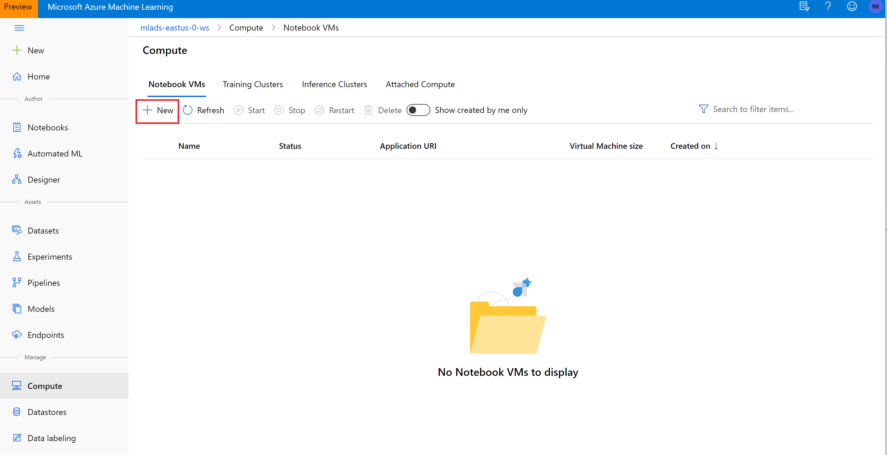

# MLADS Workshop Guide: Automated Machine Learning
## Contents
1. [Introduction](#Introduction)
1. [Setup](#Setup)
1. [Part 1 - Hyperdrive](#HyperDrive)
1. [Part 2 - Automated Machine Learning](#AutomatedML)
1. [Resources](#Acknowledgements)

## Introduction
This workshop is split into two parts. In the first part you will use automated machine learning in Azure to create, deploy and understand a classification model using the UCI Bank Marketing dataset. In the second part, you will take a previous built model and further tune the hyper parameters.

This process accepts training data and configurations settings, and automatically iterates through combinations of different feature normalization/standardization methods, models, and hyperparameter settings to arrive at the best model.

## Setup

Complete the following experiment set-up to prepare for the workshop
1. Go to https://ml.azure.com and click "Sign in".
>If you registered for the workshop online, sign in with your alias. Otherwise please see  proctor to help you get started

1. Click the `Start Now` button in the **Notebooks** pane.

1. In the **Azure ML gallery** pane select the **"..."** at the right of the **samples** folder and select **Clone**.

1. Select a folder as your target directory for the samples and click `clone` at the bottom right of the pop up.

Now your files are ready!

1. Select the `compute` tab and click on `+ New`

1. In `New Notebook VM Name`, put a unique name (ex. your alias) and use the default VM size that is selected. Click `create`

1. Select `JupyterLab` once your compute is provisioned.

## HyperDrive

1. In JupyterLabs, click through the following path **<your-alias>/samples/python/1.0.74/how-to-use-azureml/ml-frameworks/scikit-learn/train-hyperparameter-tune-deploy-with-sklearn** and open the **train-hyperparameter-tune-deploy-with-sklearn.ipynb** file.

1. You can now run the notebook either by clicking the **play** icon in the top bar or by using **Shift+Enter** in the code cells of the notebook.

> In the third cell of your notebook, set `cluster_name` = `aml-compute`

1. The Jupyter notebook contains step by-step guidance on configuration, training and exploration of a machine learning model. 
 

## AutomatedML
    
1. In JupyterLabs, click through the following path **<your-alias>/samples/python/1.0.74/how-to-use-azureml/automated-machine-learning/forecasting-energy-demand** and open the **auto-ml-forecasting-energy-demand.ipynb** file.

1. You can now run the notebook either by clicking the **play** icon in the top bar or by using **Shift+Enter** in the code cells of the notebook.

1. The Jupyter notebook contains step by-step guidance on configuration, training and exploration of a machine learning model. 

## Resources

1. What is Automated Machine Learning? : https://docs.microsoft.com/en-us/azure/machine-learning/service/concept-automated-ml

1. How to define ML tasks: https://docs.microsoft.com/en-us/azure/machine-learning/service/how-to-define-task-type 

1. Auto-train a forecasting model: https://docs.microsoft.com/en-us/azure/machine-learning/service/how-to-auto-train-forecast 

1. New at Ignite: https://azure.microsoft.com/en-us/blog/azure-machine-learning-ml-for-all-skill-levels/ 