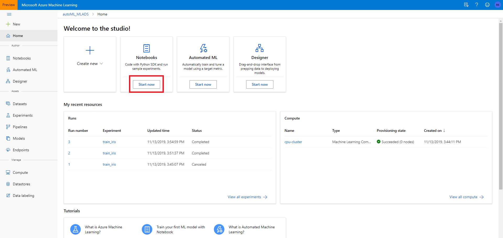
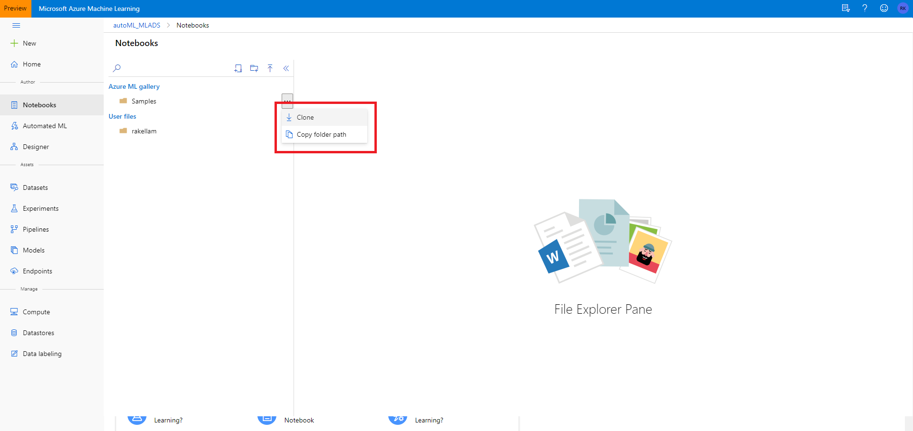
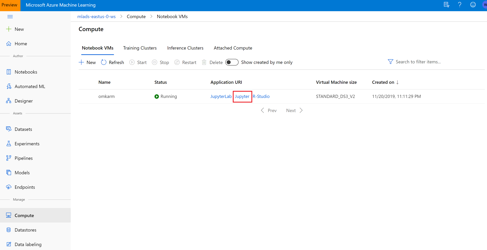
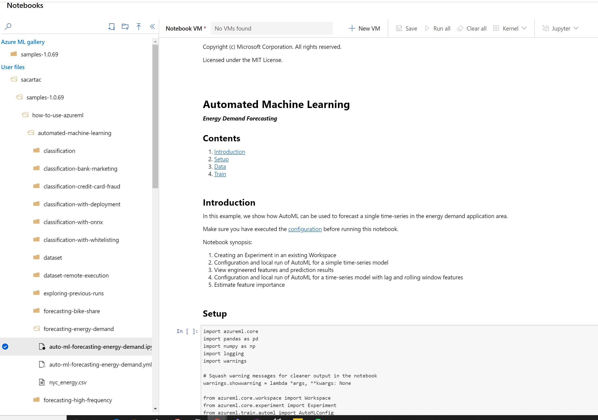
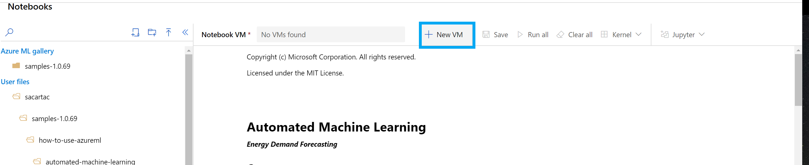
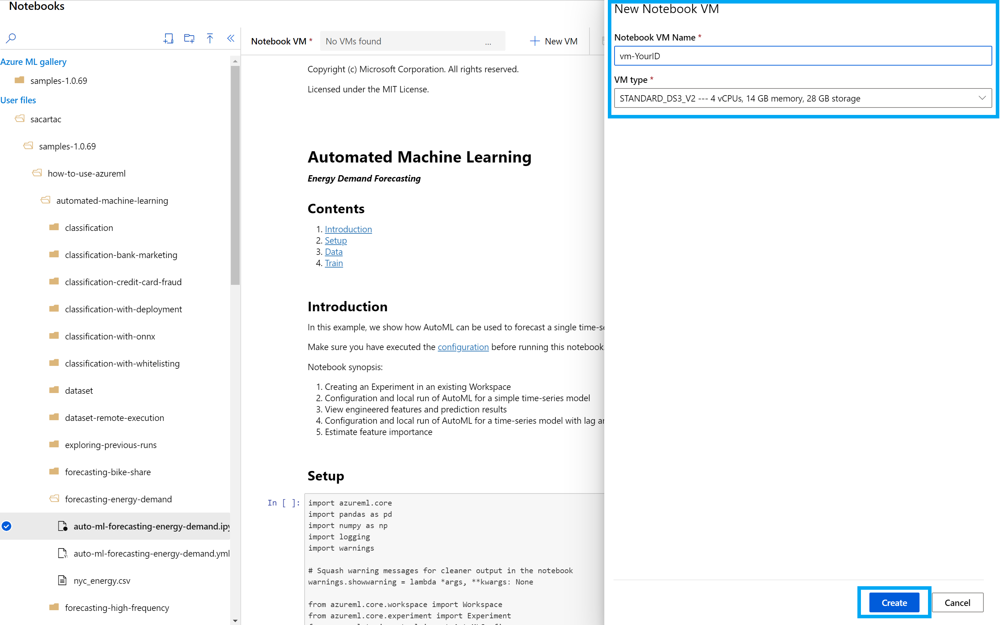
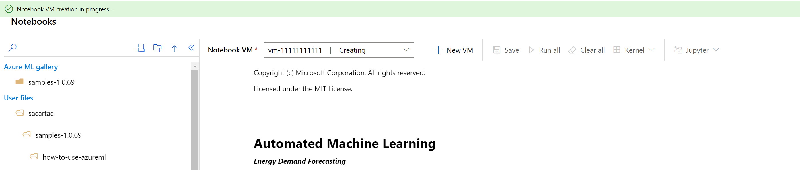

# Ignite Workshop Guide: Automated Machine Learning

## About
In this workshop, you will use automated machine learning in Azure Machine Learning to create a forecasting model to predict NYC energy demand. This process accepts training data and configurations settings, and automatically iterates through combinations of different feature normalization/standardization methods, models, and hyperparameter settings to arrive at the best model.

## Requirements
+ <b>Azure Subscription</b> -
Try [free of paid version](https://azure.microsoft.com/en-us/free/services/machine-learning/) of Azure Machine Learning today.

<!-- ------------------------------------ -->
## Clone a notebook folder

This example uses the cloud notebook server in your workspace for an install-free and pre-configured experience.

You complete the following experiment set-up and run steps in the workspace landing page (preview), a consolidated interface that includes machine learning tools to perform data science scenarios for data science practitioners of all skill levels.

1. Click the `Start Now` button in the **Notebooks** pane.

1. In the **Azure Ml gallery** pane select the **"..."** at the right of the **samples** folder and select **Clone**.

1. Select a folder as your target directory for the samples.

    
1. Under **User File** click through the following path **<your-alias>/samples/how-to-use-azureml/automated-machine-learning/forecasting-energy-demand** and open the **auto-ml-forecasting-energy-demand.ipynb** file.
    
 
> [!IMPORTANT]
> You can view notebooks in the **Azure ML gallery** pane but you cannot run a notebook from there.  In order to run a notebook, make sure you open the cloned version of the notebook in the **User Files** section.
    
## Create a VM to run the notebook

1. Select the **New VM** button to create a VM to run your notebook.

1. Fill out the **Notebook VM Name** field with the following <vm-YourID> and keep the default **VM type**. 

1. It will take a few minutes for your Notebook VM setup to complete.

1. Once the VM is available it will be displayed in the top toolbar.  You can now run the notebook either by using **Run all** in the toolbar, or by using **Shift+Enter** in the code cells of the notebook.

1. The Jupyter notebook contains step by-step guidance on configuration, training and exploration of a machine learning model.
